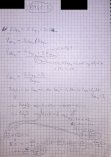
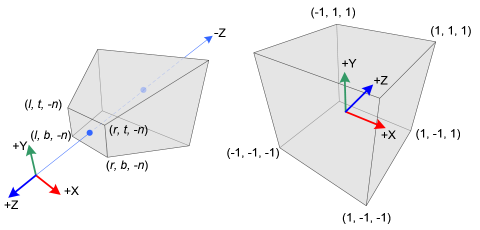

\page architecture Rendering Architecture & Pipeline

[TOC]

In this section, I go through the well-known 3D-rendering pipeline in general while providing PURE-specific information as well.

PURE currently supports fixed function pipeline only (i.e. neither vertex- nor fragment shaders).

It is useful to note that operations in the early geometry stage of the pipeline are done **per vertex**, the rest is done **per primitive (triangle)**, and rendering operations are done **per pixel**.

\section geometry_stage Geometry Stage

\subsection vertex_spec Vertex Specification

In this early stage, we define the vertex stream by specifying following:
 - **vertex attributes** (e.g. object-space position);
 - **location of storage** of this stream (e.g. host memory);
 - **primitive type** i.e. how to interpret the stream (e.g. interpret as triangles).

The order of the *vertices* in the stream is important:
 - they can be streamed in the same order as they are actually placed in memory (e.g. vertex array), or
 - in different order specified by indices in an element array.
 
The latter has an advantage on memory consumption and performance, since same (repeating) vertex attributes can be stored only once while being referred multiple times by the same index, which also means that such vertex is transformed in Vertex Processing only once, provided there is a *post-T&L Cache*.

TODO: add PPP info on this.

\subsection vertex_proc Vertex Processing

*Vertices* are transformed from object-space to clip-space with multiple matrix multiplication operations.  
Optional normals are transformed from object-space to eye-space/view-space.  
These are calculated on the GPU nowadays thanks to HW T&L.  
**The result of calculations done in this stage can be checked in [PR00FPSvsPURE-Transformations.xlsx.](PR00FPSvsPRRE-Transformations.xlsx)**

Since PURE uses OpenGL, we need to understand how transformations are happening in OpenGL:
 - matrix multiplications happen in reverse order, e.g. setting a perspective projection matrix then translating it in OGL results in translating first, then multiplying by the projection matrix;
 - 4x4 float matrices are used as transformation matrices;
 - transformation matrices are stored as 1D arrays in column-major order (!);
 - [http://www.songho.ca/opengl/gl_transform.html](http://www.songho.ca/opengl/gl_transform.html);
 - [https://www.opengl.org/archives/resources/faq/technical/transformations.htm](https://www.opengl.org/archives/resources/faq/technical/transformations.htm)

#### Modeling Transformation

Transforming the *vertices* **from model-space to world-space**. Simple matrix multiplication.

**Model / Object Space**: where each model is in its own coordinate system, whose origin is some point on the model, such as the right foot of a soccer player model. Also, the model will typically have a control point or “handle”. To move the model, the 3D renderer only has to move the control point, because model space coordinates of the object remain constant relative to its control point. Additionally, by using that same “handle”, the object can be rotated.

**World Space**: where models are placed in the actual 3D world, in a unified world coordinate system. The OpenGL API doesn’t really have a world space.

#### View Transformation

Transforming the *vertices* from **world-space to view-space** (simulating a viewer/camera). Simple matrix multiplication.

**View / Eye / Camera Space**: in this space, the view camera is positioned by the application (through the graphics API) at some point in the 3D world coordinate system. The world space coordinate system is then transformed, such that the camera (your eye point) is now at the origin of the coordinate system, looking straight down the z-axis into the scene. Whether z values are increasing or decreasing as you move forward away from the camera into the scene is up to the programmer, but for now assume that z values are increasing as you look into the scene down the z-axis.  
Note that culling, back-face culling, and lighting operations can be done in view space.

Note: in OpenGL, we have a combined **ModelView matrix** by a **Model- and View Matrix**. See more at [http://www.songho.ca/opengl/gl_transform.html#modelview](http://www.songho.ca/opengl/gl_transform.html#modelview) .

Vertex normals are also transformed from **model-space to view-space** but in a little different way. See more at [http://www.songho.ca/opengl/gl_normaltransform.html](http://www.songho.ca/opengl/gl_normaltransform.html) .  
Vertex normals are consumed by the pipeline in this space by the lighting equation and as a result, vertex colors are updated.

nVidia’s Chief Scientist Dave Kirk: “lighting is the luminance value, whereas shading is about reflectance and/or transmittance.”  
These are related to lighting, but shading calculations occur later in the pipeline after rasterization.

Generate (if necessary) and transform texture coordinates.

#### Projection Transformation

Transforming the *vertices* from **view-space to clip-space**. Simple matrix multiplication: multiply by **projection matrix**.  
**Clip Space**: Similar to view space, but the frustum is now “squished” into a unit cube, with the x and y coordinates normalized to a range between –1 and 1, and z is between 0 and 1, which simplifies clipping calculations. The **clipping planes** are now orthogonal (perpendicular) to the axes of the space.  
The **projection matrix** defines the **viewing frustum** and the **projection mode (perspective or orthogonal)**.  
The **view volume** is actually created by this projection, which as the name suggests, “projects the scene” in front of the camera. Think of the camera as a kind of holographic projector, but instead of projecting a 3D image into air, it instead projects the 3D scene “into” your monitor.  
The shape of this view volume is either rectangular (called a **parallel projection**), or pyramidal (called a **perspective projection**), and this latter volume is called a **view frustum** (also commonly called frustrum, though frustum is the more current designation).  

More about projection:  
 - [http://www.songho.ca/opengl/gl_transform.html#projection](http://www.songho.ca/opengl/gl_transform.html#projection)
 - [https://www.opengl.org/wiki/GluPerspective_code](https://www.opengl.org/wiki/GluPerspective_code)
 - [https://www.opengl.org/sdk/docs/man2/xhtml/gluPerspective.xml](https://www.opengl.org/sdk/docs/man2/xhtml/gluPerspective.xml)

In the past I managed to understood [Song Ho Ahn's explanation about how to define the projection matrix](http://www.songho.ca/opengl/gl_projectionmatrix.html).  
Based on that I also defined it on paper (in case I ever need this again), how to define it with (f,n,l,r,b,t) parameters:  

  
In the last picture it is also explained how to define (l,r,b,t) parameters from input aspectRatio and fovX or fovY parameters.

Note: using OpenGL either right- or left-handed viewing system can be used. PURE uses left-handed coordinate system by avoiding gluPerspective().  
See more at [https://anteru.net/2011/12/27/1830/](https://anteru.net/2011/12/27/1830/) .  
Projection matrix tricks: [http://www.terathon.com/gdc07_lengyel.pdf](http://www.terathon.com/gdc07_lengyel.pdf) .

Related OpenGL API: gluPerspective(), gluLookAt(), glFrustum().

Related PURE API: TODO.

\subsection primitive_assembly Primitive (Triangle) Assembly

Primitives are assembled from the *vertices* coming from the previous stage. *Vertices* are transformed from **clip-space to screen-space**.

Note: some say the Clipping, Perspective Divide and Viewport Transformation are not in this stage but in a separate stage called “Vertex Post-processing”.

#### Clipping

Though the view space frustum has clipping planes, clipping is actually performed when the frustum is transformed to clip space.  
The view volume defines what the camera will see, but just as importantly, it defines what the camera won’t see, and in so doing, many models and parts of the world can be discarded, sparing both 3D chip cycles and memory bandwidth.  
The top of the frustum is called the **near (or front) clipping plane** and the back is called the **far (or back) clipping plane**.  
The entire rendered 3D scene must fit between the near and far clipping planes, and also be bounded by the sides and top of the frustum. If primitives of the model (or parts of the world space) falls outside the frustum, they won’t be processed.  
Actually 3 things can happen to a *primitive*:

 - **discarded (culled)**, when entirely outside of the viewing volume/frustum;
 - **clipped** (calculating new *vertex* coordinates as appropriate) when partially outside of the viewing volume, the external portion needs to be clipped off at the frustum boundary. This can generate more than 1 triangle from 1 triangle if required;
 - leave unchanged, when entirely inside the clipping volume.

Actually not all primitives that are partially outside of the viewing volume may be clipped, check about **guard-band clipping**: [https://fgiesen.wordpress.com/2011/07/05/a-trip-through-the-graphics-pipeline-2011-part-5/](https://fgiesen.wordpress.com/2011/07/05/a-trip-through-the-graphics-pipeline-2011-part-5/) .

The clipping behavior against the Z-coordinate of the *vertices* can be modified by enabling **depth clamping**: if enabled, clip-space Z-coordinates are not clipped by the near and far planes.

#### Perspective Divide

Transforming **clip coordinates to normalized device coordinates**, into [-1; 1] range by dividing clip-space (x,y,z) coordinates by clip-space w.

[http://stackoverflow.com/questions/3255837/z-value-after-perspective-divide-is-always-less-than-1](http://stackoverflow.com/questions/3255837/z-value-after-perspective-divide-is-always-less-than-1)

Perspective Frustum (left) and Normalized Device Coordinates (NDC) (right)  
image source: [http://www.songho.ca/opengl/gl_projectionmatrix.html](http://www.songho.ca/opengl/gl_projectionmatrix.html)

image source: [http://www.terathon.com/gdc07_lengyel.pdf](http://www.terathon.com/gdc07_lengyel.pdf)

#### Viewport Transformation

Transforming **normalized device coordinates to screen/window coordinates**. Depth values are transformed into [0; 1] range.

**Screen Space**: where the 3D image is converted into x and y 2D screen coordinates for 2D display. Note that z and w coordinates are still retained by the graphics systems for depth/Z-buffering (see Z-buffering section below) and back-face culling before the final render. Note that the conversion of the scene to pixels, called rasterization, has not yet occurred.

Related OpenGL API: glViewPort(), glDepthRange().

Related PURE API: TODO.

#### Face Culling

“3D graphics is the art of cheating without getting caught.” Translated, this means that one of the art-forms in 3D graphics is to elegantly reduce visual detail in a scene so as to gain better performance, but do it in such a way that the viewer doesn’t notice the loss of quality. One quick example of this is culling.

Applies to primitives with at least 3 vertices only, usually triangles. A triangle can be discarded (culled) based on its facing. This is done by the winding order of the triangle. It can be CW (clockwise) or CCW (counter-clockwise) depending how the triangle’s 3 *vertices* rotate in order around the center of the triangle.

Note: face culling can be done in either view space (after view transform, checking the angle between the viewing vector and the triangle’s normal vector) or screen space (testing if triangle’s projected normal vector points away or towards the camera).

Related OpenGL API: glFrontFace(), glEnable(GL_CULL_FACE), glCullFace().

Related PURE API: TODO.

\section raster_stage Rasterization / Rendering Stage

\subsection triangle_setup Triangle Setup / Scan-Line Conversion

*Fragments* are generated from the primitives in this stage.

Some define the rasterization stage as including triangle setup, whereas others view triangle setup as a separate step that precedes the rasterization/rendering stage of the pipeline. Think of triangle setup as the prelude to the rasterization/rendering stage of the pipeline, because it “sets the table” for the rendering operations that will follow.

There are 2 tasks to be done here:

 - **defining spans**: finding out which pixels are covered by the incoming triangle;
 - **shading spans**: interpolating vertex attributes across the triangle.

#### Defining Spans

Note that the explained behavior below is out-of-date and hardware in last decades do triangle setup differently but I’m still writing about the legacy behavior because it might be easier to understand.

First off, the triangle setup operation computes the slope (or steepness) of a triangle edge using vertex information at each of edge’s two endpoints. Using the slope information, an algorithm can calculate x,y values to see which pixels each triangle side (line segment) touches. The process operates horizontal scan line by horizontal scan line. It determines how much the x value of the pixel touched by a given triangle side changes per scan line, and increments it by that value on each subsequent scan-line.

Note that each scan line is the next incremental y coordinate in screen space. The y values of non-vertex points on the triangle edge are approximated by the algorithm, and are floating-point values that typically fall between two integer y values (scan lines). The algorithm finds the nearest y value (scan line number) to assign to y.

We now have x,y values for all scan line crossing points of each line segment in a triangle. The portion of a scan line that bridges the two triangle edges is called a **span**.

image source: [https://www3.ntu.edu.sg/home/ehchua/programming/opengl/CG_BasicsTheory.html](https://www3.ntu.edu.sg/home/ehchua/programming/opengl/CG_BasicsTheory.html)

#### Shading Spans

Up until this point, only *vertices* have had color and depth information, but now that the triangle edge pixels are being created, interpolated color and depth values must also be calculated for those pixels. In addition, the texture coordinates are also calculated by interpolation for use during texture mapping.
More details about shading techniques in the Glossary.

Related OpenGL API: TODO.

Related PURE API: TODO.

\subsection fragment_processing Fragment Processing

#### Early Depth/Stencil Testing

As an optimization, modern GPUs do the *depth- and stencil-testing* before doing any fragment processing. This way fragment processing can be rejected if depth- or stencil test fails, skipping the whole *fragment shading* process.  
PURE renders opaque object in front-to-back order that leads to more rejected fragments, in order to achieve higher rendering speeds.

If neither tests fail, a *texel* is generated from texture memory and it is applied to each *fragment*. Then fog calculations are applied.  
In case of a programmable pipeline, *fragment shaders* are processing the *fragments* generated in the previous step.

Related OpenGL API: TODO.

Related PURE API: TODO.

\subsection sample_processing Per-Sample Processing

Usual operations of this final stage are depth testing, blending, etc.

Details at: [https://www.opengl.org/wiki/Per-Sample_Processing](https://www.opengl.org/wiki/Per-Sample_Processing) .

#### Pixel Ownership Test

This fails and [fragments](#_Fragment) are discarded if the [pixels](#_Pixel) covered by the [fragments](#_Fragment) are covered by another window thus OpenGL doesn’t own these covered [pixels](#_Pixel).

Related OpenGL API: TODO.

Related PURE API: TODO.

#### Scissor Test

Fails if the [fragments](#_Fragment) fall outside of the scissor rectangle.

Related OpenGL API: TODO.

Related PURE API: TODO.

#### Alpha Test

Related OpenGL API: TODO.

Related PURE API: TODO.

#### MSAA (MultiSample AntiAliasing)

This is a method to achieve FSAA (fullscreen antialiasing). More at: [https://www.opengl.org/wiki/Multisampling](https://www.opengl.org/wiki/Multisampling) .

Related OpenGL API: TODO.

Related PURE API: TODO.

#### Stencil Test

Fails if the specified stencil function fails between the source and destination stencil values. This feature is unsupported by PURE. Related: [HyperZ](#_HyperZ_(ATi)).

Related OpenGL API: TODO.

Related PURE API: TODO.

#### Depth Test

Fails if the specified depth function between the source and destination depth values fails. If depth test passes for a [fragment](#_Fragment) then the Occlusion Query gets updated if there is an active query. Related: [HyperZ](#_HyperZ_(ATi)). More on depth testing and precision:

 - [http://learnopengl.com/#!Advanced-OpenGL/Depth-testing](http://learnopengl.com/#!Advanced-OpenGL/Depth-testing)
 - [https://developer.nvidia.com/content/depth-precision-visualized](https://developer.nvidia.com/content/depth-precision-visualized)

Related OpenGL API: TODO.

Related PURE API: TODO.

The **Depth Buffer** stores floating point depth values in the [0;1] range. Precision can be 16-, 24- or 32-bit. Description and tricks for depth buffer and testing can be found on the following pages:  
 - [https://developer.nvidia.com/content/depth-precision-visualized](https://developer.nvidia.com/content/depth-precision-visualized)  
 - [http://learnopengl.com/#!Advanced-OpenGL/Depth-testing](http://learnopengl.com/#!Advanced-OpenGL/Depth-testing)

#### Blending

Related OpenGL API: TODO.

Related PURE API: TODO.

#### Dithering

When the incoming [fragment](#_Fragment) color can’t be stored exactly due to less precision of the output image, 2 representable colors can be used instead of the incoming color: the one from rounding up and the other from rounding down. It depends on the implementation which will be used. If dithering is enabled, the output color will be selected based on the position of the [fragment](#_Fragment), by varying between the 2 selectable colors. GL_DITHER

Related OpenGL API: TODO.

Related PURE API: TODO.

#### Logic Operations

Unsupported by PURE.

Related OpenGL API: TODO.

#### Write Mask

Masking off writing to particular buffers. Unsupported by PURE.

Related OpenGL API: TODO.

# Do’s and don’t’s

“Style guides and usage books don't agree. The Chicago Manual of Style and others recommend dos and don'ts. The Associated Press and others recommend do's and don'ts. Eats, Shoots & Leaves recommends do's and don't's” - [http://www.quickanddirtytips.com/education/grammar/dos-and-donts](http://www.quickanddirtytips.com/education/grammar/dos-and-donts)