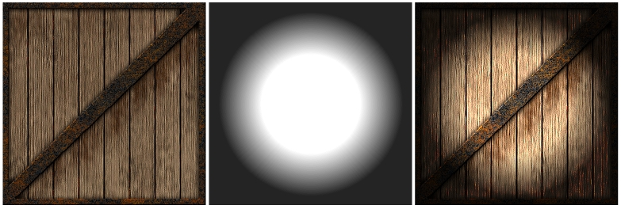

# Glossary

[TOC]

Intentionally not in alphabetical order.

## Scene

A virtual 2- or 3-dimensional place or space where things happen, e.g. [CJ is chasing some vagos on a train in Los Santos](https://www.youtube.com/watch?v=6y7o3RNgWR8).

## Rendering

Generating an image of a 2- or 3-dimensional scene.

## Pipeline

Sequence of processing tasks arranged so that the output of each task is the input of the next task.

## Graphics / Rendering Pipeline

Software and/or hardware implementation of a [pipeline](#_Pipeline) where the input is a bunch of scene data and the output is an image of the [scene](#_Scene) as a result of the consecutive [rendering](#_Rendering) tasks.  
More details in [Rendering Pipeline Architecture](#_Rendering_Pipeline_Architecture).

## Pixel

Smallest element of an image. Color and position, usually in screen-space. An image having size 800x600 pixels means it has 800x600 individual pixels, organized into 800 columns and 600 rows where each pixel has its unique color and position.

## Vertex

Smallest element of a 2D or 3D object. A vertex has many attributes such as color, position, texture coordinates, etc.

## Primitive / Face

2D or 3D shape made of very limited number of vertices. The most common primitive is a triangle, made of 3 vertices.  
It's worth noting that 3D modeler software use this same term for primitive meshes (e.g. cube, sphere) but in 3D graphics programming we don't.

## Mesh

Multiple primitives build up a mesh. A 3D mesh usually consists of hundreds or thousands of triangle primitives.

image source: [Sammy Rogmans: A Generic Framework for Implementing Real-Time Stereo Matching Algorithms on the Graphics Processing Unit](https://www.researchgate.net/publication/265310715_A_Generic_Framework_for_Implementing_Real-Time_Stereo_Matching_Algorithms_on_the_Graphics_Processing_Unit)

## Vertex Shader

TODO.

## Pixel / Fragment Shader

TODO.

## Vertex Pipeline / Processor

Execution unit. Executes [vertex shader](#_Vertex_Shader) instructions. 1 pipeline processes 1 vertex.

## Vertex Processing / Shader Unit

SIMD principle. Contains multiple [vertex processors](#_Vertex_Pipeline_/).

## Pixel / Fragment Processor / Pipeline

Execution unit. Executes [pixel / fragment shader](#_Pixel_/_Fragment_1) instructions. 1 pipeline processes 1 [fragment](#_Fragment).

## Fragment Processing / Shader Unit

SIMD principle. Contains multiple [fragment processors](#_Pixel_/_Fragment).

## Unified Shader

TODO. Since Geforce 8xxx / Radeon HD2xxx series.

## Fragment

A screen-space position and some other data like output of a vertex shader (e.g. color, depth). There will be at least one fragment produced for every frame buffer pixel area covered by the primitive being rasterized.

## Raster Pipeline / ROP / Z-pipe

Execution unit. Executes scissor test, alpha test, stencil test, depth test and blending.

## Raster Operation Unit

Contains multiple [raster pipelines](#_Raster_Pipeline_/).

## Fragment Crossbar

Routes the [fragments](#_Fragment) coming from the [fragment pipelines](#_Pixel_/_Fragment) to the [ROPs](#_Raster_Pipeline_/) (this is needed as the number of [fragment pipelines](#_Pixel_/_Fragment) is not equal to the number of [ROPs](#_Raster_Pipeline_/)).

## Texel

TODO.

## Texture

TODO.

## Texture Unit

TODO. The number of texture units defines the maximum number of [textures](#_Texture) accessed at the same time by the same [fragment shader](#_Pixel_/_Fragment_1). **Texture access** is aka **texture lookup** aka **texture fetching**.

## Texture Filtering

TODO.

## Isotropic Filtering

TODO.

## Anisotropic Filtering

TODO.

## MIP mapping

## Multitexturing

## Aliasing

TODO.

## Antialiasing, AA

TODO.

## Multisample Antialiasing, MSAA

TODO. The render output units super-sample only the Z buffers and stencil buffers, and using that information get greater geometry detail needed to determine if a pixel covers more than one polygonal object. This saves the pixel/fragment shader from having to render multiple fragments for pixels where the same object covers all of the same sub-pixels in a pixel. This method fails with texture maps which have varying transparency (e.g. a texture map that represents a chain link fence).

### Quincunx Antialiasing (nVidia)

TODO. A blur filter that shifts the rendered image a half-pixel up and a half-pixel left in order to create sub-pixels which are then averaged together in a diagonal cross pattern, destroying both jagged edges but also some overall image detail.

Since Geforce 3.

### AccuView Antialiasing (nVidia)

TODO. 4XS. Since Geforce 4.

### Transparency Antialiasing (nVidia)

TODO. Since Geforce 7.

### Coverage Sampling Antialiasing, CSAA (nVidia)

TODO. Since Geforce 8.

[http://www.nvidia.com/object/coverage-sampled-aa.html](http://www.nvidia.com/object/coverage-sampled-aa.html)

## Supersampled Antialiasing, SSAA

Render the scene large size internally then scale the result down to the output resolution. Slower than [MSAA](#_MultiSample_Antialiasing,_MSAA).

## Shading ##

Shading is one of those terms that sometimes seems like a semantic football, as noted earlier, Dave Kirk, Chief Scientist at nVidia describes it this way: “Lighting is the luminance value, whereas shading is about reflectance or transmittance.” The three most common shading methods are: flat, Gouraud, and Phong, operate per triangle, per vertex, and per pixel, respectively.

image source: [https://www.quora.com/What-is-an-explanation-of-the-Gouraud-shading-and-phong-shading-models-in-simple-form](https://www.quora.com/What-is-an-explanation-of-the-Gouraud-shading-and-phong-shading-models-in-simple-form)

### Flat Shading ###

The simplest of the three models, here the renderer takes the color values from a triangle’s three vertices (assuming triangles as primitive), and averages those values (or in the case of Direct3D, picks an arbitrary one of the three). The average value is then used to shade the entire triangle. This method is very inexpensive in terms of computations, but this method’s visual cost is that individual triangles are clearly visible, and it disrupts the illusion of creating a single surface out of multiple triangles. (Lathrop, O., The Way Computer Graphics Works, Wiley Computer Publishing, New York, 1997)

### Gouraud Shading ###

Named after its inventor, Henri Gouraud who developed this technique in 1971 (yes, 1971). It is by far the most common type of shading used in consumer 3D graphics hardware, primarily because of its higher visual quality versus its still-modest computational demands. This technique takes the lighting values at each of a triangle’s three vertices, then interpolates those values across the surface of the triangle. Gouraud shading actually first interpolates between vertices and assigns values along triangle edges, then it interpolates across the scan line based on the interpolated edge crossing values. One of the main advantages to Gouraud is that it smoothes out triangle edges on mesh surfaces, giving objects a more realistic appearance. The disadvantage to Gouraud is that its overall effect suffers on lower triangle-count models, because with fewer vertices, shading detail (specifically peaks and valleys in the intensity) is lost. Additionally, Gouraud shading sometimes loses highlight detail, and fails to capture spotlight effects, and sometimes produces what’s called Mach banding (that looks like stripes at the edges of the triangles).

### Phong Shading ###

Also named after its inventor, Phong Biu-Tuong, who published a paper on this technique in 1975. This technique uses shading normals, which are different from geometric normals. Phong shading uses these shading normals, which are stored at each vertex, to interpolate the shading normal at each pixel in the triangle. Unlike a surface normal that is perpendicular to a triangle’s surface, a shading normal (also called a vertex normal) actually is an average of the surface normals of its surrounding triangles. Phong shading essentially performs Gouraud lighting at each pixel (instead of at just the three vertices). And similar to the Gouraud shading method of interpolating, Phong shading first interpolates normals along triangle edges, and then interpolates normals across all pixels in a scan line based on the interpolated edge values.

### Dot-product texture blending, DOT3 ###

Debuted in the DirectX 6 version of Direct3D. A prelude to programmable shaders, this technique gains the benefit of higher resolution per-pixel lighting without introducing the overhead of interpolating across an entire triangle. This approach is somewhat similar to Phong shading, but rather than calculating interpolated shading normals for every pixel on the fly, DOT3 instead uses a normal map that contains “canned” per-pixel normal information. Think of a normal map as a kind of texture map. Using this normal map, the renderer can do a lookup of the normals to then calculate the lighting value per pixel. Once the lighting value has been calculated, it is recombined with the original texel color value using a modulate (multiply) operation to produce the final lit, colored, textured pixel. Essentially, DOT3 combines the efficiencies of light maps, wherein you gain an advantage having expensive-to-calculate information “pre-baked” into a normal map rather than having to calculate them on the fly, with the more realistic lighting effect of Phong shading.

## Rendering Pipeline Architecture

Describing the usual steps in a rendering pipeline that produces a rendered image of a 3D object, with the help of the picture below:

image source: [http://www.adobe.com/devnet/flashplayer/articles/how-stage3d-works.html](http://www.adobe.com/devnet/flashplayer/articles/how-stage3d-works.html)

First we define the *vertex* stream. Modeling-, view-, and projection transformations on the *vertices* including optional normals are done. *Primitives* (e.g. triangles) are assembled from the transformed *vertices*, clipping is applied and then they are further transformed to screen/window-space. Then during rasterizing we find out which pixels are covered by the incoming triangles, and interpolate *vertex* attributes across the triangle. These generated values are *fragments*. Color, depth and stencil values are generated from each *fragment* with the use of optional textures. The final steps include depth testing, blending. etc.  
Note that a more detailed description about rendering pipeline can be found on a dedicated page of the internal documentation called Rendering Architecture & Pipeline.

In some sense, 3D chips have become physical incarnations of the pipeline, where data flows “downstream” from stage to stage. Computations in various stages of the pipeline can be overlapped, for improved performance. For example, because vertices and pixels are mutually independent of one another in both Direct3D and OpenGL, one triangle can be in the geometry stage while another is in the Rasterization stage. Furthermore, computations on two or more vertices in the Geometry stage and two or more pixels (from the same triangle) in the Rasterzation phase can be performed at the same time.  
Following picture is an example of a rendering pipeline architecture implemented in HW. A bit more specific than the previous picture:

image source: [http://www.ozone3d.net/tutorials/gpu_sm3_dx9_3d_pipeline_p02.php](http://www.ozone3d.net/tutorials/gpu_sm3_dx9_3d_pipeline_p02.php)  
Note: as seen in the picture, [Rasterizer](#_Rasterization_1) is not equal to [Raster Operation Unit](#_Raster_Operation_Unit).

## HW T&L - Hardware Transformation and Lighting

Moving the *vertex* transformation and lighting calculations from SW (CPU) to HW (GPU).

Since Geforce 256.

PURE implicitly benefits of this thanks to the vendors’ OpenGL implementation.

image source: [http://www.anandtech.com/show/391/5](http://www.anandtech.com/show/391/5)

### Pre-Transform (pre-T&L) Cache

Stores the untransformed [vertices](#_Vertex). Optimizations regarding this part of the cache are simply sorting the [vertices](#_Vertex) in order of appearance. Typically extremely large, being able to hold ~64k [vertices](#_Vertex) on a Geforce 3 and up.

### Post-Transform (post-T&L) Cache

This is a GPU FIFO buffer containing data of [vertices](#_Vertex) that have passed through this stage but not yet converted into [primitive](#_Primitive). Can be used with indexed rendering only (element arrays). 2 [vertices](#_Vertex) are considered equal if their index is the same within the same drawing command. If so, the processing of the current [vertex](#_Vertex) is skipped in this stage and the output of the appropriate previously-processed [vertex](#_Vertex) data is added to the output stream. Varies in size from effectively 10 (actual 16) [vertices](#_Vertex) on GeForce 256, GeForce 2, and GeForce 4 MX chipsets to effectively 18 (actual 24) on GeForce 3 and GeForce 4 Ti chipsets.

AMD Tootle is recommended for optimizing 3D-models: [http://developer.amd.com/tools-and-sdks/archive/legacy-cpu-gpu-tools/amd-tootle/](http://developer.amd.com/tools-and-sdks/archive/legacy-cpu-gpu-tools/amd-tootle/)

There is some other vertex cache optimization: [http://home.comcast.net/~tom_forsyth/papers/fast_vert_cache_opt.html](http://home.comcast.net/~tom_forsyth/papers/fast_vert_cache_opt.html)

[https://www.opengl.org/wiki/Post_Transform_Cache](https://www.opengl.org/wiki/Post_Transform_Cache)

[http://www.opentk.com/doc/advanced/vertex-cache-optimization](http://www.opentk.com/doc/advanced/vertex-cache-optimization)

## Culling

Removing hidden objects from rendering. This means we can determine hidden objects somehow and skip rendering them since they wouldn't make any change to the final rendered image anyway. Examples: Occlusion Culling, View Frustum Culling. More on this in \ref visibility.

## Hidden Surface Removal

Same as [Culling](#Culling).

## AGP Fast Writes

A method of allowing the CPU to send data directly to the AGP bus without having to use main system memory. Speeds up AGP reads. Doesn’t have effect on AGP writes.

Since Geforce 256.

PURE implicitly benefits if current HW and SW supports Fast Writes.

## HyperZ (ATi)

Z- and Stencil Buffer optimization techniques. See the 3 techniques below.

Since Radeon R100 (7xxx series).

TODO: add how PURE benefits.

### Hierarchical Z, HiZ

We manage 8x8 blocks of [pixels](#_Pixel) (tiles) and store the maximum (LESS, LEQUAL) or minimum (GREATER, GEQUAL) Z-value for each tile. During [triangle rasterization](#_Rasterization_1), we calculate the minimum/maximum Z-value for each triangle. First we compare this value to the tile’s maximum/minimum Z-value: if the triangle’s minimum/maximum Z-value is greater/less than the tile’s maximum/minimum Z-value, it means the triangle is not visible at all and can be early rejected (**Early Z Reject**). This is much faster than comparing the triangle’s Z-values to the stored values in the depth buffer.

Before the HD2xxx series, this information was stored in on-chip memory. Since the HD2xxx series, it is stored in off-chip memory.

Since the HD2xxx series, HiZ is applied on the stencil buffer as well.

### Z Compression

If a tile contains very few number (1-2) of triangles, instead of storing all Z-values in that tile, store the plane equation for that triangle(s). So this is a lossless compression. Does not reduce the amount of memory that is required to store the depth buffer. It only saves bandwidth. It will still need to allocate the full buffer to handle all potential uncompressed states.

### Fast Z Clear

Benefit of Z Compression. Instead of writing the depth clear value across the entire depth buffer, we just reset the state of all tiles to “cleared” (by storing the plane equation for a constant Z=1 triangle).

## Lightspeed Memory Architecture, LMA (nVidia)

Memory bandwidth optimizations including similar features as [HyperZ](#_HyperZ_(ATi)). **Z-Occlusion Culling** ~ [HiZ](#_Hierarchical_Z,_HiZ). **Occlusion query**: determining if the geometry to be rendered will be visible by using a bounding box occlusion test first.

Since Geforce 3.

## Nvidia Shading Rasterizer, NSR (nVidia)

TODO. Programmable pixel pipeline. Since Geforce 2.

## Render to Vertex Buffer, R2VB

TODO. Since Radeon X1xxx series.

## High Dynamic Range Rendering, HDR

TODO. Since Geforce 6xxx series.

## Shadow Buffers (nVidia)

TODO. Since Geforce 3.

## UltraShadow (nVidia)

TODO. Since Geforce FX57xx series.

[http://www.tomshardware.com/reviews/nvidia-geforcefx-5900-ultra,630-4.html](http://www.tomshardware.com/reviews/nvidia-geforcefx-5900-ultra,630-4.html)

## UltraShadow II (nVidia)

TODO. Since Geforce 6xxx series.
<!--stackedit_data:
eyJwcm9wZXJ0aWVzIjoidGl0bGU6IFBVUkUgR2xvc3Nhcnlcbm
F1dGhvcjogUFIwMEY4OFxuZGF0ZTogJzIwMjAtMTEtMjInXG4i
LCJoaXN0b3J5IjpbLTkzNzU4MDQ1MywtNTM2NDU3NDcsLTk5Mz
A2NjY4NV19
-->