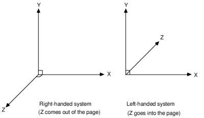

\page usage Engine Usage

[TOC]

Main class of the engine is PR00FsUltimateRenderingEngine. Initialization, shutdown, and access to other engine classes are done through this main class.

This page gives you a brief hint on the usage, but you can always check the UnitTests as well for different cases.  

\section coordsystem Coordinate System

PURE uses the left-handed Cartesian coordinate system. This means the XZ plane is horizontal, the XY and and YZ planes are vertical, a positive X value means right, a positive Y value means up, and a positive Z value means forward.


image source: https://www.researchgate.net/figure/Right-and-Left-Handed-Coordinate-systems_fig1_2457107

\section initialization Initialization

PR00FsUltimateRenderingEngine::initialize() is responsible for initialization.  
The user can select which renderer should be initialized with the engine.  
The detailed documentation of this function can be found at the initialize() member function of these renderers. The reason for this is that some renderer may not use a parameter or may use it in a different way than another renderer.  
All renderers must implement the PureIRenderer interface.

Currently the following renderers are available:  
 - PureRendererSWincremental
 - PureRendererHWfixedPipe

PR00FsUltimateRenderingEngine initializes one of the above renderers at initialization.  

Example code snippet for initializing the engine, with PureRendererHWfixedPipe renderer, with a 800x600 pixels window and 24 bpp Z-buffer:

```.cpp
  PR00FsUltimateRenderingEngine& engine = PR00FsUltimateRenderingEngine::createAndGet();
  if ( engine.initialize(Pure_RENDERER_HW_FP, 800, 600, Pure_WINDOWED, 0, 32, 24, 0, 0) != 0 ) {
      // error handling
  }
  // continue with engine
```

Related PURE API: PR00FsUltimateRenderingEngine::initialize(), PureIRenderer::initialize().  

\section loading Loading Resources

Resources such as textures, 3D models, etc. can be created or loaded by Managers.  
Any class derived from PureManager is a manager.

Following resource-specific Managers are available:  
 - PureImageManager : parsing image files and creating PureImage objects of them;
 - PureTextureManager : creating PureTexture objects from existing PureImage objects or by parsing image files;
 - PureMaterialManager : creating PureMaterial objects programatically or by parsing material files;
 - PureMesh3DManager : parsing 3D mesh files and creating PureMesh3D objects of them;
 - PureObject3DManager : extending PureMesh3DManager with the ability of creating PureObject3D objects;
 - PureMesh3D : is also a Manager, managing its own submeshes of the same PureMesh3D class;
 - PureVertexTransfer : extending PureMesh3D by vertex transfer mode (geometry pipeline) configuration ability;
 - PureObject3D : extending PureVertexTransfer by rendering code, to be utilized by the current renderer implementing PureIRenderer.

Note that Managers are only available when the engine is initialized.  
Managers can be accessed by the relevant get...() member functions of main class PR00FsUltimateRenderingEngine.

Example code snippet for creating a texture from an image file:

```.cpp
  PureTexture* myTexture = engine.getTextureManager().createFromFile("texture.bmp");
  if ( myTexture == PGENULL ) {
      // error handling
  }
  // continue with myTexture
```

Example code snippet for creating a renderable object from a 3D mesh file:

```.cpp
  PureObject3D* myObject = engine.getObject3DManager().createFromFile("mesh.obj");
  if ( myObject == PGENULL ) {
      // error handling
  }
  // continue with myObject
```

Related PURE API: TODO  

\section rendering Rendering

As mentioned at the Initialization section above, there are multiple renderers available. 
The initialized renderer object can be accessed with PR00FsUltimateRenderingEngine::getRenderer().

Rendering can be executed with the PureIRenderer::RenderScene() implementation of the initialized renderer object.

Example code snippet for rendering:

```.cpp
  engine.getRenderer().RenderScene(); 
```

Related PURE API: PR00FsUltimateRenderingEngine::getRenderer(), PureIRenderer::RenderScene().  

\section shutdown Shutdown

Graceful termination of the client application can be a reason for shutting down the graphics engine.  
Another reason could be the need for changing some basic renderer setting that can be specified only in PR00FsUltimateRenderingEngine::initialize().  
In any case, PR00FsUltimateRenderingEngine::shutdown() should be called that also invokes the PureIRenderer::shutdown() implementation of the current renderer.  
You don't need to take care of any previously loaded resources since the engine makes sure that all managers do their cleanup routine as well.

Note that an uninitialized engine cannot be shut down. First you need to initialize the engine to shut it down.  
I know this sounds weird, but [sometimes it is not straightforward](https://i.imgur.com/CWfyFbB.jpg). :)

Example code snippet for shutdown:

```.cpp
  if ( !engine.shutdown() ) {
      // error handling
  } 
```

Related PURE API: PR00FsUltimateRenderingEngine::shutdown(), PureIRenderer::shutdown().


\section samples Samples

TODO